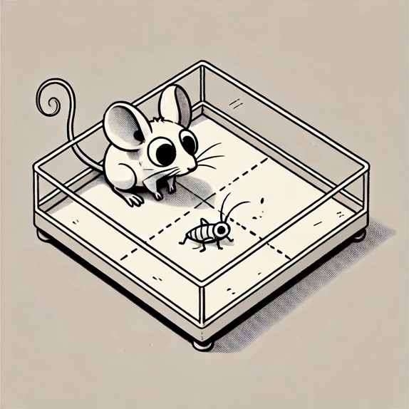

# Behavioral Tracking Analysis Code Repository

Code for behaviour tracking analysis of experiments for paper [1].



## Data Analysis Pipeline

### 1. Preprocessing Script
The script `preprocessing.ipynb` is used to preprocess the data of each experiment. The raw data is called from the folder "dlc_preprocessed_data" (deep lab cut preprocessed videos) that can be found in [4]. The sessions analysed are those indicated in `session.txt`.

The code takes the raw matrix of position labels of each subject and classifies 3 types of behaviours:
- Approach
- Contact  
- Exploration

#### Output Files
The code loops through each session and computes in the analysed folder:

**analysed/tables:**
- `behaviour_matrix_df`: Agreggated behaviour matrix filtered by the behaviour_thr
- `raw_matrix_df`: Raw matrix dataframe with computed variables

**analysed/video:**
- A labelled video for each session with the computed parameters and behavior type
> **Note:** More information available in `preprocessing.ipynb`

### 2. Data Analysis and Visualization
The following notebooks are used for figure creation, statistics and data mungling using the preprocessed data:

- `analysis_by_contact.ipynb`: Data analysis filtering approaches that end in contact
- `analysis_by_time_thr.ipynb`: Data analysis filtering behaviors by a time threshold
- `figures_approaches_contacts.ipynb`: Example figures of approaches, explorations and contacts through each session
- `figure_orientation_distance`: Distance to cricket and head orientation figures 
- `circular_statistics` folder: R code for figure 6 j-k

## DeepLabCut Video Preprocessing

### Preprocessing Instructions
The code in `preprocessing_dlc.ipynb` is used for generating the DLC filtered tables used in the analysis. The filtered DLC videos were generated using the DLC GUI. Due to a path recognition bug, run the following to access the GUI:

```bash
python -m deeplabcut
```

**Additional Resources:**
- Raw data for model training: [2]
- Training videos: [3]
- Labelled data and trained model: [4]

## Environment Setup

### Available Environments
1. **analysis.yml**: For all analysis
```bash
conda env create -n analysis.yml
```

2. **tf.yml**: For deep lab cut preprocessing
```bash
conda env create -n tf.yml
```

## Running the Analysis

### Step-by-Step Instructions
1. Install the analysis environment
2. Download the labelled data from [4] and extract the folder `dlc_preprocessed_data` inside this repository
3. Delete the zip file
   > Note: Cloud version users should already have the folder in the repository
4. Run `preprocessing.ipynb`
5. Run the notebooks from step 2 (Data mungling, statistics and figures)

## Authors and Contact

**Author:**  
Arturo José Valiño Pérez

**Corresponding Author:**  
Arturo José Valiño Pérez (arturo-jose.valino@incipit.csic.es)

## References and resources

1. Genetic Rewiring of Retinothalamic Neurons Induces Ocular Dominance Columns in mice and Enhances Binocular Vision and Predatory Behaviors 
2. https://saco.csic.es/apps/files/files/217962888?dir=/zic2/code_data_zic2/data/raw_data/prey_hunting
3. https://saco.csic.es/apps/files/files/222213335?dir=/zic2/code_data_zic2/data/raw_data/prey_hunting/videos_for_model_training
4. https://saco.csic.es/apps/files/files/222227744?dir=/zic2/code_data_zic2/data/raw_data/prey_hunting/dlc_preprocessed_data
